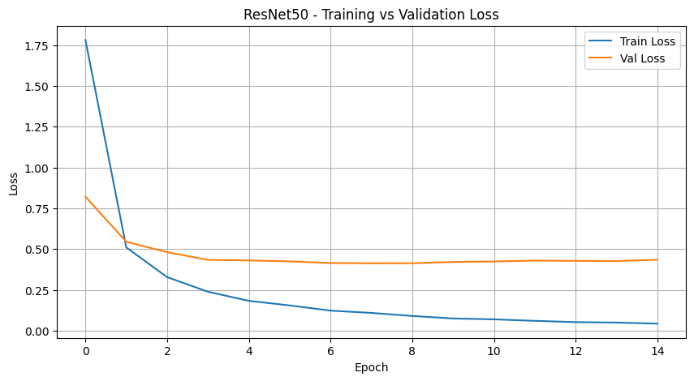
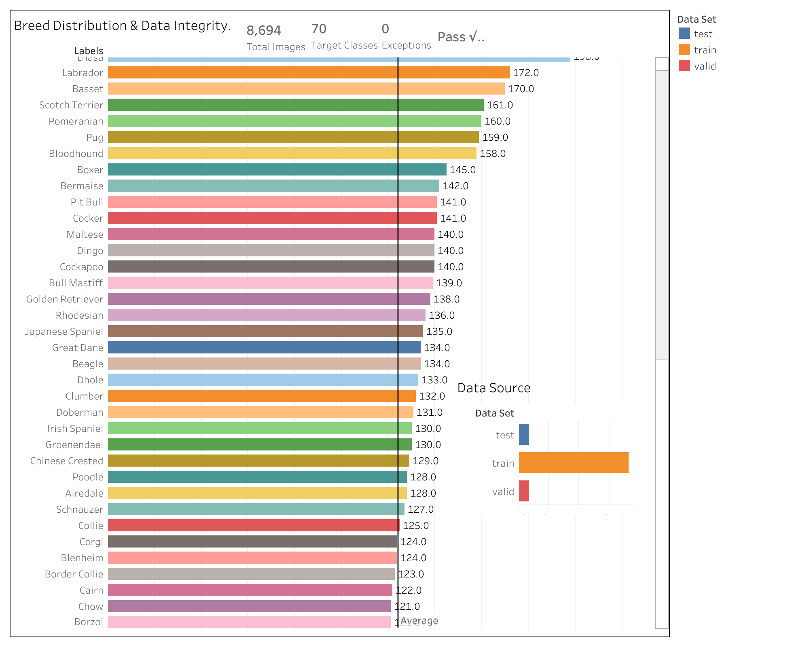

# Dog Breed Classifier — Pluto's Repawsitory

A convolutional neural network that identifies dog breeds from photos. Built as a capstone project for The Knowledge House Data Science Fellowship, Phase 3.


---

## The Problem

Animal shelters manually identify dog breeds on intake — a process that's slow, inconsistent, and error-prone. Misidentified breeds affect adoption listings and housing eligibility for adopters. We built a model that gives shelters an automated first pass from a single photo.

## Pipeline Overview

**Raw data → SQL database → preprocessing → training → app (Sprint 4)**

1. **EDA** — explored class distribution, image dimensions, and class imbalance across 70 breeds
2. **SQL database** — built a SQLite metadata store tracking file path, label, split, dimensions, and quality flags for all 8,694 images
3. **Preprocessing** — custom PyTorch Dataset class, ImageNet normalization, augmentation on train only (flip, rotation, color jitter), WeightedRandomSampler for class imbalance
4. **Training** — pretrained ResNet50 and MobileNetV2, base layers frozen, classification head replaced with Linear(2048, 70) and Linear(1280, 70). Trained with CrossEntropyLoss + Adam
5. **App** — FastAPI backend + demo interface, Sprint 4

The inference pipeline applies the same resize (224×224) and normalization (mean=[0.485, 0.456, 0.406], std=[0.229, 0.224, 0.225]) as training — so the model never sees a distribution it wasn't trained on.

---

## Demo

> Screenshot / GIF coming after Sprint 4 deployment

---

## Results — Model Comparison

We trained two models and compared performance on 700 held-out test images across 70 breeds.

### ResNet50 — Google Colab T4 GPU

| Metric | Score |
|--------|-------|
| Accuracy | 96.14% |
| Precision | 96.30% |
| Recall | 96.14% |
| F1 Score | 96.09% |

**Loss Curves**


Train loss dropped from 1.78 to 0.04 over 15 epochs. Validation loss stabilized around 0.43 by epoch 4 — clean convergence, no overfitting.

**Confusion Matrix**



Near-perfect diagonal across all 70 classes. The few misclassifications cluster around visually similar breeds — Golden Retrievers vs. Labradors, similar Terrier varieties.

### MobileNetV2 — Local CPU

| Metric | Score |
|--------|-------|
| Accuracy | In progress |
| Precision | In progress |
| Recall | In progress |
| F1 Score | In progress |

Lightweight architecture (89,670 trainable parameters vs ResNet50's 143,430). Optimized for CPU inference — chosen specifically for deployment scenarios without GPU access.

---

## Dataset

[70 Dog Breeds Image Dataset](https://www.kaggle.com/datasets/gpiosenka/70-dog-breedsimage-data-set) — Kaggle

70 breeds, ~8,694 images, pre-split into train / valid / test. Images resized to 224×224. We used the dataset's built-in 70/15/15 split rather than the common 80/20 default, giving the model more meaningful validation signal across rare breeds.



## Database Schema


---

## Repo Structure

```
dog-breed-classification/
├── notebooks/
│   ├── 01_eda.ipynb                      # Exploratory data analysis
│   ├── 02_preprocessing.ipynb            # Cleaning, transforms, augmentation
│   ├── 03_model_training.ipynb           # MobileNetV2
│   └── 03_model_training_resnet50.ipynb  # ResNet50 (Colab)
├── data/                                 # Images and CSV (gitignored)
├── models/                               # Saved weights (gitignored)
├── outputs/                              # Loss curves, confusion matrices
├── docs/
├── sprint2_database.py                   # SQL metadata script
├── dogs_updated.csv
└── README.md
```

---

## Setup

```bash
git clone https://github.com/YOUR_USERNAME/dog-breed-classification.git
cd dog-breed-classification
pip install torch torchvision pandas scikit-learn matplotlib seaborn

# Download dataset
kaggle datasets download -d gpiosenka/70-dog-breedsimage-data-set --unzip -p data/

# Run notebooks in order
# 01_eda → 02_preprocessing → 03_model_training
```

For ResNet50: open `03_model_training_resnet50.ipynb` in Google Colab, set runtime to T4 GPU.

---

## Sprint Plan

| Sprint | Dates | Focus | Status |
|--------|-------|-------|--------|
| 1 | 6/3 – 6/11 | Project setup, EDA | Done |
| 2 | 6/11 – 6/25 | SQL database, preprocessing | Done |
| 3 | 6/25 – 7/9 | Model training and evaluation | In progress |
| 4 | 7/9 – 7/16 | Demo app, presentation | Upcoming |

---

## Team

| Name | Role |
|------|------|
| Dre (Lead) | Architecture, SQL database, notebook structure |
| Cameron | Data cleaning, label fixes, training loop |
| Manuela | Preprocessing pipeline, augmentation, evaluation |
| Ozor | Class imbalance, WeightedRandomSampler, loss curves |

---

## Challenges

- **Class imbalance** — some breeds had significantly fewer images. Solved with WeightedRandomSampler so underrepresented breeds weren't ignored during training.
- **CPU training limits** — MobileNetV2 was chosen for its smaller footprint on local CPU. ResNet50 moved to Google Colab with a T4 GPU.
- **Label bugs** — whitespace inconsistencies in the original CSV caused silent label mismatches. Fixed before any preprocessing ran.

## What's Next

- Fine-tune deeper ResNet50 layers for additional accuracy gains
- FastAPI backend + image upload interface
- Deploy for shelter use without requiring any code

---

*The Knowledge House — Data Science Fellowship, Phase 3*
*Dataset: [gpiosenka on Kaggle](https://www.kaggle.com/datasets/gpiosenka/70-dog-breedsimage-data-set)*
