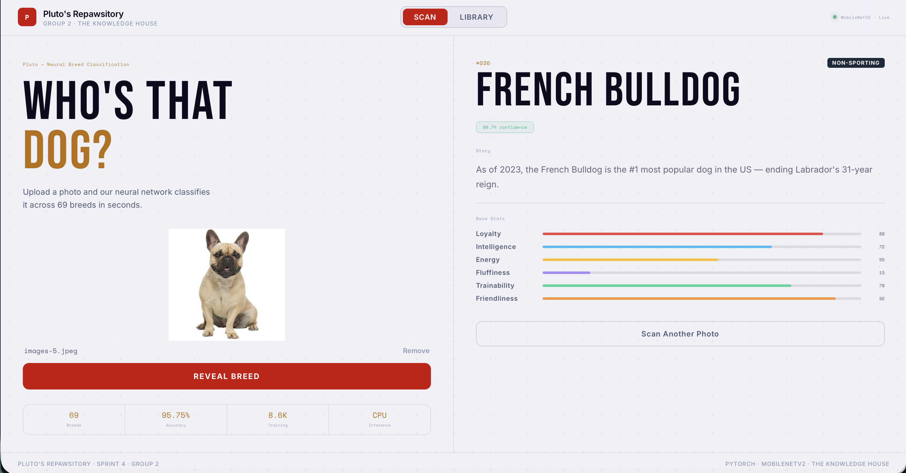
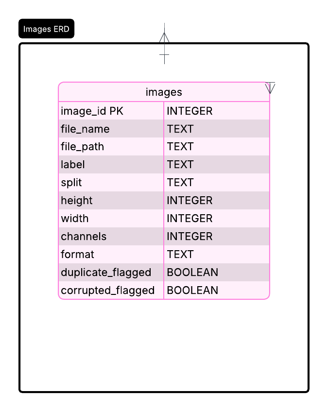
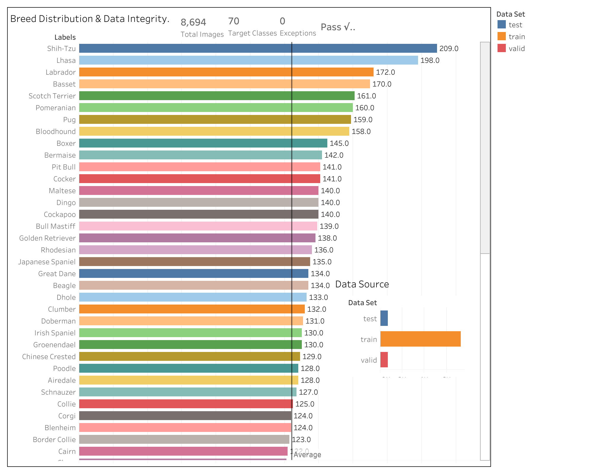
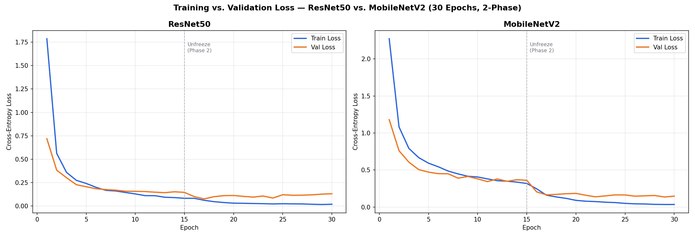

# Pluto's Repawsitory

**An app that identifies dog breeds from a single photo to support automated intake processing at animal shelters.**

Built as a capstone project for The Knowledge House Data Science Fellowship, Phase 3 — full pipeline from raw data to a deployed web application.

[](https://www.python.org/)
[](https://pytorch.org/)
[](https://fastapi.tiangolo.com/)
[](https://dog-breed-classification-wtir.onrender.com)
[](https://colab.research.google.com/)

---

## Live Demo

**[https://dog-breed-classification-wtir.onrender.com](https://dog-breed-classification-wtir.onrender.com)**



Upload any dog photo → the model returns the top 3 predicted breeds with confidence scores in under a second. Includes a full breed library of all 69 classes with real photos, group filters, and searchable by name.

---

## Table of Contents

- [Problem Statement](#problem-statement)
- [Dataset](#dataset)
- [Pipeline Overview](#pipeline-overview)
- [Database Schema (ERD)](#database-schema-erd)
- [EDA Dashboard](#eda-dashboard)
- [Results](#results)
- [Tech Stack](#tech-stack)
- [Repo Structure](#repo-structure)
- [Setup](#setup)
- [Team](#team)
- [Challenges](#challenges)
- [What's Next](#whats-next)
- [Acknowledgments](#acknowledgments)

---

## Problem Statement

Animal shelters manually identify dog breeds on intake — a process that is slow, inconsistent, and prone to error. Misidentified breeds affect adoption listings, restrict placement options, and can affect housing eligibility for adopters in breed-restricted buildings.

We built a tool that gives shelter staff an automated first pass from a single photo, with a confidence score and two alternative predictions so workers can make informed decisions rather than guesses. The long-term goal is a containerized tool shelters can self-host that feeds predictions directly into their intake database.

---

## Dataset

**Source:** [70 Dog Breeds Image Dataset](https://www.kaggle.com/datasets/gpiosenka/70-dog-breedsimage-data-set) — Kaggle (gpiosenka)

- **Size:** 8,692 images across 69 breeds
- **Class balance:** Some breeds have significantly fewer images than others — addressed with `WeightedRandomSampler` during training
- **Split:** 70% train / 15% validation / 15% test

The 70/15/15 split is the course standard rather than the common 80/20 pattern. We chose this deliberately — a larger validation and test set gives more reliable signal across rare breeds with fewer than 100 images, where an 80/20 split would leave too few samples to catch overfitting.

---

## Pipeline Overview

```
Raw Images → SQLite Database → Preprocessing → Training → FastAPI App
```

**1. EDA** — Explored class distribution, image dimensions, and class imbalance across all 69 breeds. Identified outliers, corrupt files, and label inconsistencies before any data touched the model.

**2. SQL Database** — Built a SQLite metadata store (`sprint2_database.py`) tracking file path, breed label, train/valid/test split, image dimensions, and quality flags for all 8,692 images. Queried throughout the pipeline to ensure clean, consistent data access.

**3. Preprocessing** — Custom PyTorch `Dataset` class. All images resized to **224×224** and normalized using ImageNet statistics (`mean=[0.485, 0.456, 0.406]`, `std=[0.229, 0.224, 0.225]`). Augmentation applied to the training set only: random horizontal flip, ±15° rotation, color jitter. `WeightedRandomSampler` ensures underrepresented breeds receive proportional training exposure.

**4. Training** — Pretrained MobileNetV2 and ResNet50 from `torchvision`. Base layers frozen in Phase 1 (15 epochs), then unfrozen for full fine-tuning in Phase 2 (15 more epochs). Classification heads replaced with `Linear(1280, 69)` and `Linear(2048, 69)`. Optimizer: Adam. Loss: CrossEntropyLoss.

**5. Deployment** — The trained MobileNetV2 exports to a 9.1 MB `.pt` file. A FastAPI server loads it at startup and runs inference on every `/predict` request.

**Deployment contract:** The inference endpoint applies the same 224×224 resize and the same ImageNet normalization used during training — the model never sees a pixel distribution at inference that it was not trained on. This is enforced in `app.py` rather than left to the client.

---

## Database Schema (ERD)

We built a SQLite metadata database in Sprint 2 to track every image in the pipeline — file path, breed label, train/valid/test split assignment, image dimensions, and a quality flag. The ERD below shows the schema.



---

## EDA Dashboard

Class distribution, image counts per breed, and split coverage visualized in Tableau.



---

## Results

We evaluated both models on 682 held-out test images across all 69 breeds.

| Model | Accuracy | Precision | Recall | F1 Score | Params | Hardware |
|-------|----------|-----------|--------|----------|--------|----------|
| **MobileNetV2** *(deployed)* | **95.75%** | 96.19% | 95.75% | 95.68% | ~3.5M | Colab T4 GPU |
| ResNet50 | 97.51% | 97.70% | 97.51% | 97.52% | ~25M | Colab T4 GPU |

**Training vs. Validation Loss — Both Models (30 Epochs, 2-Phase)**



Both models use the two-phase training strategy. The dashed line marks the Phase 2 unfreeze. ResNet50 converges faster and reaches lower loss overall. MobileNetV2 stays tighter across Phase 2 with less divergence between train and validation loss.

**Where the model struggles:** The most common misclassifications occur between visually similar breeds — Golden Retrievers and Labrador Retrievers, and between similar Terrier varieties. The model also assumes a single purebred dog in frame; mixed-breed photos or partial shots (face only, blurry background dog) return lower confidence scores and less reliable predictions. These cases show up correctly as lower confidence in the "Also Considered" results rather than a wrong confident answer.

---

## Tech Stack

| Layer | Tools |
|-------|-------|
| Modeling | PyTorch 2.2 · MobileNetV2 · ResNet50 · CrossEntropyLoss · Adam |
| Data | SQLite · Pandas · Kaggle API |
| Backend | FastAPI 0.111 · Uvicorn · Python 3.10 |
| Frontend | Vanilla JavaScript · CSS3 · Dog CEO API |
| Deployment | Docker · Render.com |
| Training Environment | [Google Colab](https://colab.research.google.com/) · T4 GPU · Jupyter Notebooks |
| Data Visualization | Tableau · Matplotlib · Seaborn |
| Database | SQLite |

---

## Repo Structure

```
dog-breed-classification/
├── app/
│   ├── app.py                    # FastAPI backend — /predict endpoint + model loading
│   ├── Dockerfile                # Render.com deployment
│   ├── requirements.txt
│   ├── models/
│   │   └── mobilenet_v2_dogbreed_regularized.pt   # 9.1 MB trained model
│   └── static/
│       └── index.html            # Frontend: scan view + breed library
├── src/                          # React/Vite version of the frontend
│   ├── App.jsx
│   ├── breeds.js
│   └── main.jsx
├── notebooks/                    # Team Jupyter notebooks — EDA, preprocessing, training
├── outputs/
│   └── ozor_loss_curves.png      # Training vs. validation loss — both models
├── sprint2_database.py           # SQLite metadata pipeline
├── dogs_updated.csv              # Cleaned breed labels
├── package.json                  # React/Vite dependencies
└── README.md
```

---

## Setup

```bash
git clone https://github.com/drehandley/dog-breed-classification.git
cd dog-breed-classification/app

pip install -r requirements.txt
uvicorn app:app --reload --port 8000
# Open http://localhost:8000
```

No frontend build step required — FastAPI serves the HTML and static files directly from one process.

To retrain the model, download the dataset first:

```bash
kaggle datasets download -d gpiosenka/70-dog-breedsimage-data-set --unzip -p data/
# Then run the notebooks in order: EDA → preprocessing → training
```

---

## Team

| Name | Role |
|------|------|
| **Dre Handley** *(Lead)* | Project architecture, SQL database, deployment, app frontend |
| **Cameron Bridgwater** | Data cleaning, label normalization, training loop |
| **Manuela Chalen** | Preprocessing pipeline, augmentation strategy, model evaluation |
| **Ozor Moya** | Class imbalance analysis, WeightedRandomSampler, loss curve visualization |

---

## Challenges

**Class imbalance** — Breed representation in the dataset is uneven. Without intervention, the training loop would see popular breeds far more often than rare ones. `WeightedRandomSampler` recalculates sampling probability per class so every breed gets proportional exposure during training.

**Deployment constraints** — ResNet50 at ~25M parameters is too slow to serve on a free CPU cloud tier within a usable response time. MobileNetV2 uses depthwise-separable convolutions to achieve 7x fewer parameters with only a ~1.8% accuracy trade-off, making real-time CPU inference possible.

**Label bugs** — Whitespace inconsistencies in the source CSV caused silent mismatches between image file paths and their assigned class labels. These were caught during EDA before any preprocessing ran. A single mislabeled sample at this stage would corrupt the model's understanding of that class.

---

## What's Next

- Unfreeze deeper ResNet50 layers with a longer training schedule — 97.51% still has room
- Multi-label classification head for mixed-breed identification
- CSV export so predictions feed directly into shelter intake databases
- Expand from 69 breeds to 120 using the Stanford Dogs Dataset

---

## Acknowledgments

- Dataset: [gpiosenka on Kaggle](https://www.kaggle.com/datasets/gpiosenka/70-dog-breedsimage-data-set)
- Dog photos in the breed library: [Dog CEO API](https://dog.ceo/)
- The Knowledge House Data Science Fellowship, Phase 3

---

*The Knowledge House — Data Science Fellowship, Phase 3 · Group 2*
